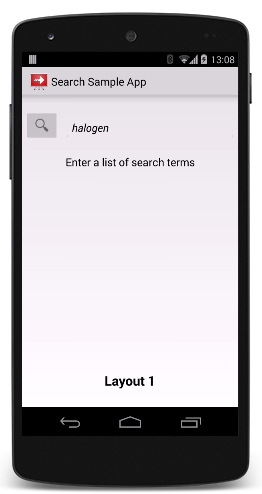

## 转换框架

应用程序的用户界面动画提供更多的不仅仅是视觉上的吸引力。动画明显的变化并提供视觉提示，帮助用户了解应用程序是如何工作的。

安卓提供了转换框架 ，帮助你在一个视图层级和另一个视图层级之间完成动画变化。这框架适用于一个或者多个动画在层级结构上的所有视图，跟随它们变化而变化。

这个框架有跟随特性：

组-等级动画

　　适合一个或者多个动画效果在层级结构上的所有视图。

转换-基础动画

　　运行动画基于开始和结束视图视图属性值之间的变化。

内置动画

　　包括普通效果的预定义动画，例如淡出和移动。

资源文件支持

　　从布局资源文件加载视图层结构和内置动画。

生命周期回调

　　定义回调以便更好地控制动画在层级的变化过程。

## 概述

这个例子在图1显示出动画是怎么通过提供视觉线索去帮助用户的。随着应用程序从搜索条目屏幕到结果屏幕，它将淡出不再使用的视图，并淡入新的视图。

**图1.** 用户界面动画使用视觉线索

这一个动画是一个使用转换框架的例子，这个框架动画变化在两个层级结构的所有视图。一个层级结构能够更简单的选出视图和更复杂的包含一个详细视图树的[视图组](https://developer.android.google.cn/reference/android/view/ViewGroup.html)，这个框架动画每个视图在改变一次或者多次属性值后，随着时间，初始化启动视图层级到最后结束视图层级。

这个转换框架工作方式在视图层级和动画是相同的，储存视图层级的状态的目的，更改这些层次结构以修改设备屏幕的外观，和通过存储和应用动画定义来激活更改。

这个图标图2阐明视图层级、框架类和动画之间的关系。

**图2.**转换框架的关系图

这个转换框架提供抽象的场景、转换和转化管理，以下几节描述了这些内容。使用这个框架，你需要在应用程序的视图层级创建场景，以便两者之间进行更改。接下来，你在每个要使用的动画创建一个转换。在两个视图层级之间开始，你使用一个转换管理指定这个转换去使用和结束场景，这个程序描述的细节在这堂课剩下的课程。

## 场景

场景储存了视图层级的状态，包括所有视图和它们的属性值。视图层级能够简化视图，可以复杂视图树和子布局。在场景中存储视图层次结构状态可以使您从另一场景过渡到该状态。这个框架提供的[场景](https://developer.android.google.cn/reference/android/transition/Scene.html)可去代表这个场景。

这个转换框架让你通过代码在布局资源文件和[视图组](https://developer.android.google.cn/reference/android/view/ViewGroup.html)类创建场景，如果您动态生成一个视图层次结构，或者在运行时修改视图层次结构，那么在代码中创建一个场景是非常有用的。

在多半的情况中，如果你适用转换，你不能明确的创建一个启动场景。这个框架使用提供的结束场景作为任何后续转换的开始场景，如果你不实用转换，框架收集有关当前场景状态的视图信息。

在你做出场景的改变的时候运行场景,能够经常定义它拥有活动。举个例子，此功能对于在转换到场景后清理视图设置非常有用。

在添加视图层级和它的属性值，场景还将一个引用存储到视图层次结构的父级。影响场景的场景和动画的更改发生在场景根中。影响场景的场景和动画的更改发生在场景根中。此根视图称为场景根。

去学习怎么去创建场景，看[创建场景](https://developer.android.google.cn/training/transitions/scenes.html)。

## 转换

在这个转换框架，动画创建一系列的帧数，描述开始和结束场景之间的视图层次结构的变化。有关动画的信息存储在一个[转换](https://developer.android.google.cn/reference/android/transition/Transition.html)对象中。要运行动画，您可以使用[转换管理器](https://developer.android.google.cn/reference/android/transition/TransitionManager.html)实例应用转换。框架可以在两个不同的场景之间转换，或者转换到当前场景的不同状态。

该框架包括一组用于常用动画效果的内置转换，如衰减和调整视图大小。您还可以定义自己的自定义转换，以使用动画框架中的API创建动画效果。转换框架还允许您包含一组单独内置或自定义转换的转换,集中组合不同的动画效果。

这个转换生命周期类似于活动生命周期，它表示框架在动画开始和完成之间监视的过渡状态。在重要的生命周期状态中，框架调用回调方法，可以在不同阶段的转换中实现对用户界面的调整。

想学习更多关于转换，看[Applying a Transiton](https://developer.android.google.cn/training/transitions/transitions.html)和[Create Custom Transitions](https://developer.android.google.cn/training/transitions/custom-transitions.html).

##局限性

 - 动画适用于[SurfaceView](https://developer.android.google.cn/reference/android/view/SurfaceView.html)图形，可能不能正常显示出来。[SurfaceView](https://developer.android.google.cn/reference/android/view/SurfaceView.html)的实例是从非UI线程更新，所以更新可能会失去与其他视图的动画同步。
 
 - 一些特殊的转换类型可能不会产生所需的动画效果，在适用于[TextureView]()的时候。
 
 - 扩展的[AdapterView](https://developer.android.google.cn/reference/android/widget/AdapterView.html)类，比如[Listview](https://developer.android.google.cn/reference/android/widget/ListView.html),管理他们的孩子视图的方式来与转换框架不符，如果你尝试基于[AdapterView](https://developer.android.google.cn/reference/android/widget/AdapterView.html)的动画视图,设备可能会挂掉。
 
 - 如果你尝试在动画时测量大小[TextView](https://developer.android.google.cn/reference/android/widget/TextView.html)，在类完全测量大小后，文本将弹一个新位置去避免这个问题，不要动画的视图的大小调整时不要包含文本。

>翻译：[@northJjL](https://github.com/northJjL)  
>     
>原始文档：<https://developer.android.google.cn/training/graphics/opengl/draw.html#draw>